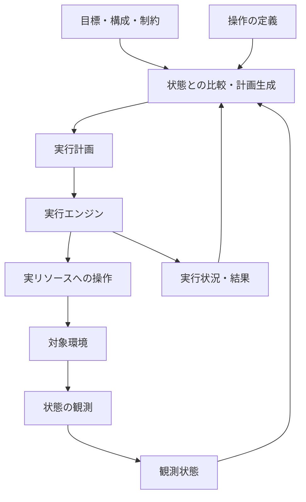

# 目標へ収束する実行基盤 — 構想とPoC

更新日: 2026-09-21

ステータス: 探索・設計段階。全体の方向性は合意済み。具体的なAPI、技術選定、実装範囲は未確定。

## 背景と動機

出発点は、[テーマ候補の検討](../../ideas/README.md)にあるControl PlaneとWorkflow / Execution Engineの境界領域への関心。

システムの仕組みを解明し、自分で設計・実装することに面白さがある。コンテナ・CI/CD・基盤ソフトウェアへの関心を出発点にするが、仕事への直接的な有用性は必須条件にしない。

今回の休暇では、約1週間、1日5〜7時間程度を使い、1〜2個の面白い成果を得たい。完成したCI/CD製品よりも、コンセプトを実際に確かめられるPoCを目指す。既存システムと用途が重なってもよいが、自分なりの設計や着眼点を持ちたい。

AIありきでテーマを決めない。問題に対して有効ならAIを中核に使うことも候補になるが、本案の最初のPoCにAIを組み込むことは前提にしない。

## コアコンセプト

> 人は構成・目標・制約を定義し、システムが現状から必要な実行計画を導く。

目標を持続的に保持し、状態の観測、計画、実行を繰り返す。実行計画は目標へ近づくために生成・更新される。

ユーザーがパイプラインを事前に記述しなくてもよい、という使い方を目指す。ただし、内部の実行順序や依存関係がなくなるわけではない。操作に関する知識を、前提条件・期待する変化・制約などとしてシステム側へ与える必要がある。

アプリケーションの構成定義だけで、テストの要否やデータ保持方針まで自動的に導けるとは考えない。どこまでを構成・目標・ポリシーとして人が指定するかも設計対象とする。

### 定型パイプラインの生成との違い

定型の手順を生成して一度実行するだけでなく、実行中の状態変化や目標変更に応じて計画を更新する。

例えば、DBがすでに利用可能なら作成を省く。APIの更新がタイムアウトした場合は、実際には更新済みかを観測して次の処理を判断する。

これは目指す設計上の特徴であり、既存製品・研究に対する新規性を確認したという意味ではない。

## 三つの方向性の関係

| 方向性 | 本構想で主に担う部分 |
| --- | --- |
| Generic Control Plane | リソースモデル、状態の観測、継続的な制御 |
| Workflow / Execution Platform | 計画の実行、依存関係、進捗、失敗・再開 |
| 目標へ収束する実行基盤 | 目標から計画を導き、観測と実行をつないで達成へ進める全体 |

Control Planeは全体を包含する呼び方にもなるため、この表は厳密な製品分類ではなく、設計上の関心の整理。

全体の方向として三つ目を据え、前二つの必要な部分を小さく実装する。①②をそれぞれ汎用製品として完成させてから統合する進め方にはしない。

## 論理構成の案

| 部分 | 責務の案 |
| --- | --- |
| 目標・制約のモデル | 何を達成したいか、許容する操作や条件を表現する |
| リソース・観測モデル | 対象の状態と、何が確認できているかを表現する |
| 操作の定義 | 実行の前提条件、期待する変化、実行方法を表現する |
| Planner | 目標と状態から必要な操作を選び、依存関係のある計画を作る |
| Executor | 計画を実行し、進捗・成功・失敗・中断を報告する |
| 制御ループ | 観測・計画・実行を接続し、目標や状態の変化を扱う |

ここでの分割は論理的なもの。別プロセス・別サービス・別リポジトリに分ける決定ではない。

操作の成功報告と、目標状態が実際に成立したことは区別する。テスト成功のような検証結果も、どのバージョンや構成に対して有効かを扱う必要がある。具体的な表現は未決定。

Plannerは未知の解決方法を発明するものではない。定義された操作や方針で達成できなければ、未達の理由や判断不能な点を示す。

## 最初のPoCの案

### 題材

APIとDBからなる一時環境。

目標の例:

> APIのversion Xと、指定のテストデータ入りDBが利用可能で、その構成に対する結合テストが通っている。

PRごとのプレビュー環境は具体的な応用先の一つ。ただし、PR連携自体を最初のPoCの必須条件には置かない。

### 操作の候補

- DBの作成
- テストデータの初期化
- APIの起動・更新
- 結合テストの実行
- 環境の削除

これは操作モデルを考えるための候補であり、すべてを初回に実装する決定ではない。

### コンセプトを確かめるシナリオ

| シナリオ | 確かめたいこと |
| --- | --- |
| 空の状態から目標を指定する | 必要な計画を生成し、実行と観測を通じて達成を確認できる |
| 条件を満たすDBがすでにある | 観測状態に応じ、DB作成を含まない計画を生成できる |
| 作成途中で目標をXからYへ変更する | 古い処理の影響を扱いながら、最新の目標へ計画を更新できる |

三つ目が、固定の手順を隠しただけではないことを示す重要な実験になる。どの操作中の変更まで扱うかは、実装前に限定する。

タイムアウト後の再観測や作成途中の削除要求も有用な検証候補だが、初回の範囲には自動的に追加しない。

### 検証の分け方

- 観測・状態モデル: 対象の現状を正しく表現できるか。
- Planner: 同じ目標でも初期状態に応じた計画ができ、達成できない場合を説明できるか。
- Executor: 計画に従って処理し、その結果を正しく報告できるか。
- 全体: 操作の結果を観測し、目標の達成または未達を判断できるか。

まず小さく一周つながるものを作り、その中の各部分を個別に検証・発展させる。

## PoC後の発展

操作数を増やすだけでなく、性質の違う操作を同じモデルで扱えるかを確かめる。

例えばキューやDNSを追加するとき、操作の前提条件・期待する変化・観測方法を定義すれば既存操作と組み合わせられるかを見る。対象を追加するたびにPlannerへ個別分岐が必要なら、モデルを見直す材料とする。

発展の軸:

- 対象: キュー、DNS、クラウドリソース、異なる実行先。
- 制約: データ保持、停止時間、承認が必要な操作。
- 信頼性: 再起動後の復帰、並行操作の競合、部分失敗、後片付け。

### 複数サービスへの拡張

将来は、複数のマイクロサービスと共有リソースからなるプロダクトも対象にしたい。

最初はAPI＋DBに絞るが、モデルを一つのアプリ専用に固定しない。サービス間の互換性、共有リソースの所有関係、部分更新失敗、計画の分割方法などは将来の論点とする。

操作を追加するだけで対応できるとは限らず、拡張可能性は検証が必要。現時点でそのための仕組みを作り込まない。

## 未決事項と、次に決めること

実装前に、最初の一周を作るために必要な範囲で決める。

1. 実行先と操作入口: Docker / Kubernetesなど、CLIなど。
2. 最小の目標・観測状態・操作の表現。
3. 限定した操作集合から計画を生成する方法。
4. 最初のPoCに含める操作と、目標変更シナリオの具体的な範囲。
5. 状態保存、失敗、実行中操作の扱いについて、どこまで保証するか。

設定言語、CUEの採用、永続化方式、汎用provider機構、分散scheduler、AIの利用、製品名は未決定。PoCに必要になったものから判断する。

長期的な探索項目や比較対象は[設計上の問い](questions.md)にまとめる。すべてを実装前に解決する必要はない。

## 他候補との関係

PRごとの一時環境基盤は、独立した候補であると同時に本構想の応用先にもなる。

システムシミュレータ、構成探索、アーキテクチャレビュー支援も候補として残す。本構想への関心が強まったことをもって、他候補を不採用にしたとは扱わない。
